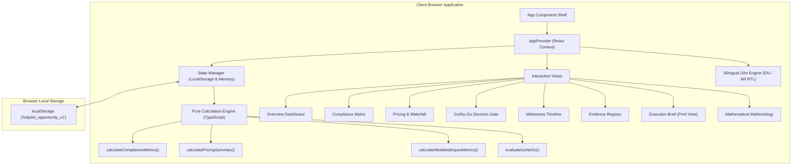
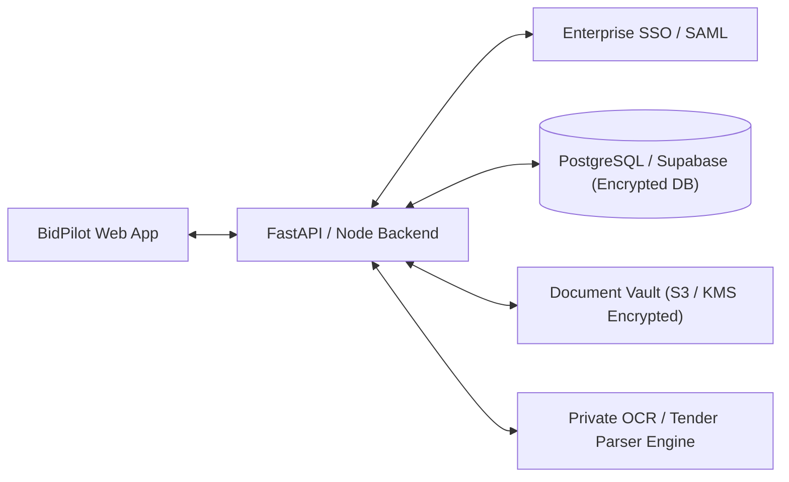

# Architecture & Systems Design

## 1. High-Level Static Architecture

BidPilot is engineered as a static client-side application designed to deploy seamlessly to GitHub Pages. All state transformations and calculations execute in the user's browser.



---

## 2. Component Hierarchy

```
src/
├── main.tsx                # React DOM root entry
├── App.tsx                 # App layout shell with responsive container
├── context/
│   └── AppContext.tsx      # Central reactive store & localStorage synchronizer
├── engine/
│   └── scoring.ts          # Pure mathematical calculation functions
├── data/
│   └── seedOpportunity.ts  # Seeded procurement opportunity dataset
├── i18n/
│   └── translations.ts     # Centralized English and Arabic dictionaries
└── components/
    ├── layout/
    │   ├── Header.tsx      # Top bar, demo disclaimer, scenario picker, reset
    │   └── Navigation.tsx  # Tab router with live notification badges
    ├── common/
    │   ├── MetricCard.tsx  # Responsive analytics metric card
    │   └── Badge.tsx       # Color-coded status badge
    └── views/
        ├── OverviewView.tsx
        ├── RequirementsView.tsx
        ├── PricingView.tsx
        ├── GoNoGoView.tsx
        ├── TimelineView.tsx
        ├── EvidenceView.tsx
        ├── ExecutiveSummaryView.tsx
        └── MethodologyView.tsx
```

---

## 3. Future Production Backend Architecture (Roadmap)

In a future production enterprise deployment, BidPilot can be integrated with a secure cloud backend:


